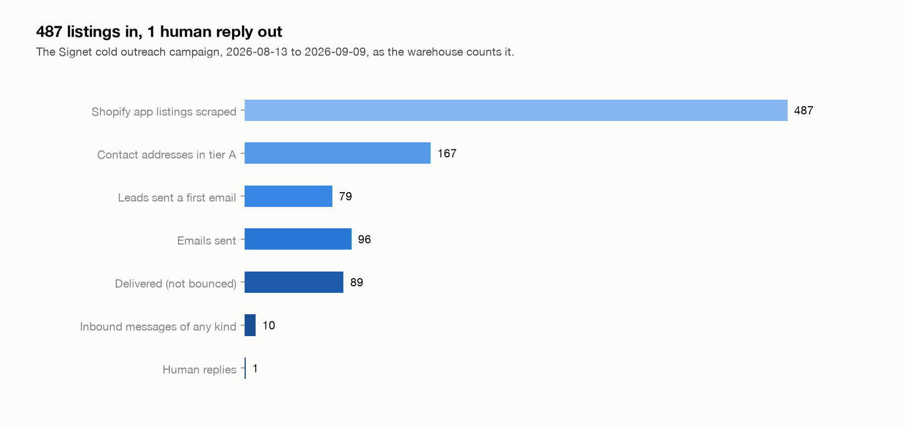
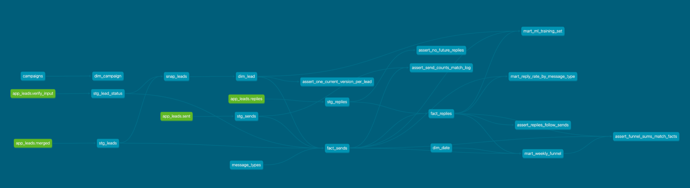
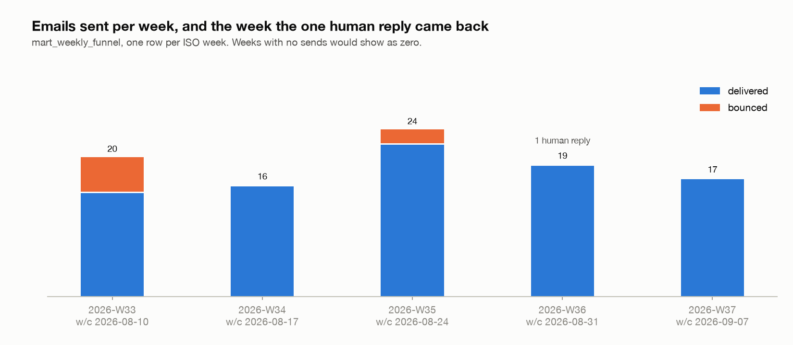

# gtm-warehouse

A small dimensional warehouse on dbt-core and DuckDB over my own cold outreach data. It runs on a schedule, reruns to identical row counts, and every number in it can be checked against the campaign tracker it came from.

I built it because the data is mine and I know what every column means. Signet is a PII redaction proxy for Shopify AI apps that I sell by cold email to the developers who publish those apps. The warehouse is the send log, the lead list, and the inbox, modeled properly.



## What the data is

Four files, copied into `raw/<date>/` on every run:

| file | grain | rows |
|---|---|---|
| `merged.json` | one Shopify app listing, scraped and tiered | 487 |
| `verify-input.csv` | one contact address, with its outreach status | 167 |
| `sent.txt` | one email sent (date, message type, address, bounce or Message-ID) | 96 |
| `replies.txt` | one inbound message (date, kind, address) | 10 |

96 emails went to 79 addresses between 2026-08-13 and 2026-09-09 across three sequences. 7 bounced. 10 things came back, 9 of them helpdesk auto-acks, a canned redirect, and a ticket close. 1 was a person answering the question. That is the whole dataset.

The emails carry no tracking pixel on purpose (the product's pitch is that PII never leaves the customer's control), so send, bounce, and reply are the only observable events. The raw files are not in the repo. They are the campaign's working files and they name who I emailed. The aggregate marts are exported to `exports/` and those are committed.

## How it's built



```
                      dim_date
                         |
 dim_campaign --- fact_sends --- dim_lead (SCD type 2)
                      |
                 fact_replies (incremental, 14-day lookback)
                      |
        mart_weekly_funnel   mart_reply_rate_by_message_type   mart_ml_training_set
```

`dim_lead` is a dbt snapshot. A lead gets a new version when its tier, contact address, address confidence, verification result, or outreach status changes. `fact_sends` carries the lead version whose `valid_from` most recently precedes the send date, or the earliest version when the send came before the snapshot history began (today that is every send; the history starts 2026-09-13). `fact_replies` attributes each inbound message to the latest first-touch email to that address, which is the tracker's rule too.

The late-arriving fact is the reply. A person answers days after the send, sometimes after the next run has already happened. `fact_replies` is incremental with a 14-day lookback, so each run reprocesses the window and picks the reply up. `tests/test_late_reply.py` proves it: build the synthetic fixture with its human reply removed, put it back, run again, and the row count moves by exactly one. A third run leaves it there.

`docs/model.md` has the grain of every table and why I picked it, including the candidate I rejected. `dbt docs generate` builds the lineage graph above from the same descriptions.

| Tool | What it does here |
|---|---|
| dbt-core 1.12, dbt-duckdb | the models, the snapshot, the seeds, 76 data tests |
| DuckDB | the warehouse, one file under `warehouse/` |
| Python 3.12, uv | the run scripts and the unittest |
| XGBoost | the retrain on the ML mart |
| launchd (one cron line on Linux) | the 07:15 daily run |

## What the numbers say

| message type | sent | bounced | delivered | human replies |
|---|---|---|---|---|
| pitch (variant B) | 20 | 2 | 18 | 0 |
| research (discovery) | 40 | 5 | 35 | 0 |
| pitch-c (variant C) | 19 | 0 | 19 | 1 |
| pitch-c-t2 (touch 2) | 17 | 0 | 17 | 0 |

No type has passed 50 sends, so the rates are noise and the mart carries a description saying so. The dataset underneath is clean, though, and the marts are built to be diffed against the tracker's own tables.



`mart_ml_training_set` is one row per lead that got a first-touch email, with the lead's attributes (tier, whether the listing declares protected customer data, address verification, rating, review count, launch year, category count, which sequence) and the label `replied`. Bounces and replies are outcomes, so they stay out of the features. `ml/train.py` fits an XGBoost classifier on it and appends a run to `ml/runs.jsonl`. The honest number is 79 rows and 1 positive. No held-out fold can contain a positive, so there is no out-of-sample AUC to report, and the script logs `auc: null` with that reason. When the mart has 5 replies the same script switches to 5-fold stratified cross-validation on its own.

## Rerun-safe

`bin/check-idempotent.sh` runs the pipeline twice over the same source files and diffs row count and a content hash per relation. The output from 2026-09-13, cut to 4 of the 15 relations:

```
relation	rows	md5(run1)	rows	md5(run2)
main.dim_lead	487	99fbe8c49d6cac67c7242b227eb0c9dc	487	99fbe8c49d6cac67c7242b227eb0c9dc
main.fact_sends	96	2bd4fae80bb1b848afecf7cd6840ee3a	96	2bd4fae80bb1b848afecf7cd6840ee3a
main.fact_replies	10	893d2f9c5c2b956460360864014f261b	10	893d2f9c5c2b956460360864014f261b
main.mart_weekly_funnel	5	3b0fdf6948d9152fda0603a132649af2	5	3b0fdf6948d9152fda0603a132649af2

identical row counts and content hashes across two consecutive runs
```

Every model has a description and at least one test; the build is 76 data tests within 91 dbt nodes. Two of the tests matter more than the rest: `assert_send_counts_match_log` fails if a send is dropped or duplicated between the raw log and the fact, and `assert_funnel_sums_match_facts` fails if the weekly mart drifts from the facts it rolls up.

## Try it with synthetic data

Install [uv](https://docs.astral.sh/uv/getting-started/installation/), then run:

```sh
uv sync
uv run python bin/demo.py
uv run python -m unittest discover -s tests -p 'test_*.py'
```

The checked-in [synthetic fixture](examples/synthetic/) contains five fictional leads and six sends using example.com addresses. It includes a bounce, an automatic response, and a human reply after a follow-up. The demo checks the attribution and identical row counts/content hashes across two builds. The test removes the human reply, restores it, and proves the incremental model picks it up exactly once.

Everything runs in a temporary database. No credentials, outreach files, or DuckDB CLI are required. These are invented examples, not campaign results.

## Run the private campaign pipeline

```sh
bin/run.sh
```

This needs my source files at `~/signet/outreach/app-leads`, or a directory set with `GTM_RAW_SRC`. They are absent from a fresh clone on purpose. After taking a snapshot, `uv run dbt build` can reuse it.

`deploy/dev.ricardoreyes.gtm-warehouse.plist` runs `bin/run.sh` every morning at 07:15 through launchd on my Mac, logging to `logs/`. Install with:

```
cp deploy/dev.ricardoreyes.gtm-warehouse.plist ~/Library/LaunchAgents/
launchctl bootstrap gui/$(id -u) ~/Library/LaunchAgents/dev.ricardoreyes.gtm-warehouse.plist
```

On Linux it is one cron line: `15 7 * * * /path/to/gtm-warehouse/bin/run.sh`.

`docs/charts.py` redraws the 2 charts above from `exports/` (`uv run --with matplotlib python docs/charts.py`).

## What I'd do with more time

- Rebuild `replies.txt` from IMAP. The sending mailbox is IMAP only, so the reply log was transcribed from the dated rows in the campaign tracker. Every row traces to a tracker line, but a script should own it.
- Raw snapshots to S3 and a Tableau Public dashboard on `exports/`. `deploy/wizard.sh` walks through both and `docs/tableau.md` is the dashboard recipe. Until they exist this README doesn't claim them.
- A payments fact, once Signet has a paying customer. There is no Stripe export today and I'd rather the table not exist than fake one.
- Enough sends for the rates to mean something: 50 per message type, and 5 human replies before the XGBoost number is worth quoting.

## Layout

```
models/staging/     typed views over the raw files, sources declared
snapshots/          snap_leads, the SCD type 2 history behind dim_lead
models/dims/        dim_lead, dim_date, dim_campaign
models/facts/       fact_sends, fact_replies
models/marts/       weekly funnel, reply rate by message type, ML training set
seeds/              campaigns and the message type map
tests/dbt/          singular tests across tables
tests/              the late-reply unittest
bin/                run.sh, check-idempotent.sh, row-counts.sh
deploy/             launchd plist, the S3 and Tableau wizard
ml/                 train.py and runs.jsonl
marts/export.sql    CSV export for the dashboard
docs/               model.md, tableau.md, charts.py and the images above
```

MIT.
